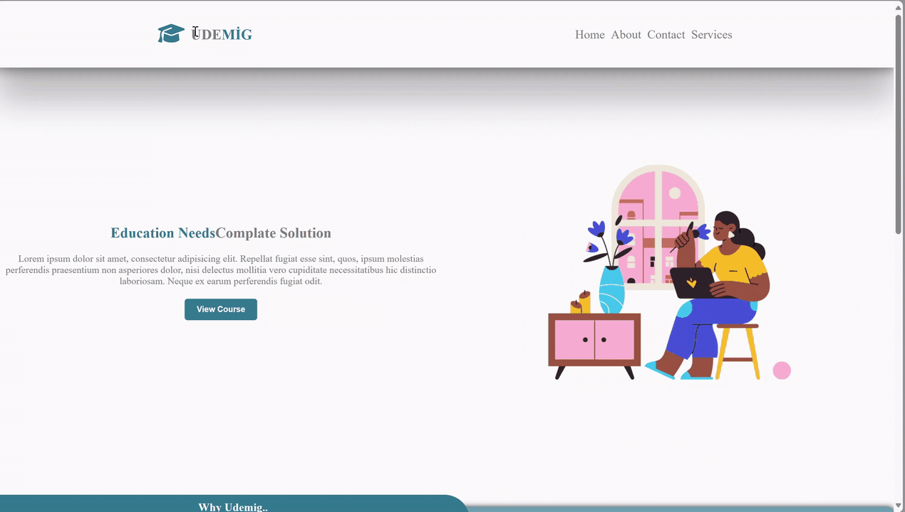

<h1>UDEMIG_Corse</h1>

In this project, we have developed a course website that provides information about instructors, courses, services, and offers details about communication and applications.

<h2>Ekran görüntüsü:</h2>

# Project Objectives

The primary goals of this project are as follows:

To present detailed information about instructors, including their qualifications and expertise.

To showcase the available courses, their descriptions.

To highlight the services offered, such as support and resources for students.

To provide clear information about communication channels, including contact details.

# Technologies Used

In this project, we utilized the following technologies:

HTML: The project utilizes HTML for structuring web pages, presenting content, and creating forms for communication and applications.

CSS: CSS is used for styling the website, making it visually appealing, and ensuring a user-friendly design.

# Sections on the Website

The website consists of several sections, including:

Instructors: Detailed profiles of the instructors, including their credentials and areas of expertise.

Courses: Information about the available courses, including descriptions, schedules, and requirements.

Services: Descriptions of services offered, such as student support, resources, and materials.

Contact: Contact information and communication channels for inquiries and assistance.

# Getting Started

To access the website, simply open the HTML files in your web browser. The "index.html" file serves as the homepage, providing navigation to various sections.
